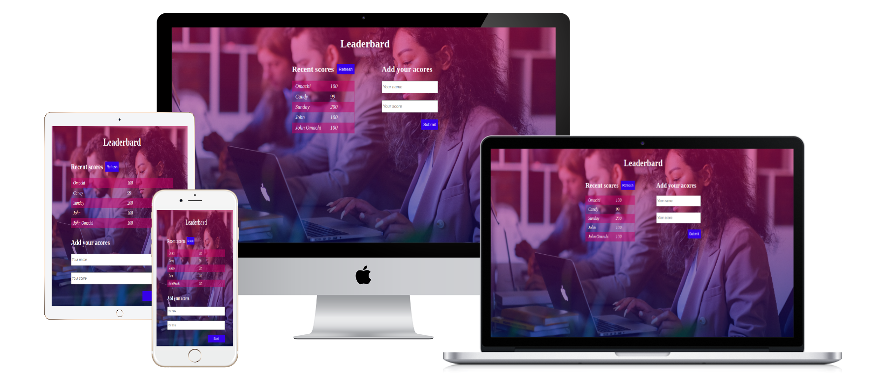

# LeaderBoard

> A JavaScript project for the Leaderboard list app, using webpack and ES6 features, this is a requirement for Micronauts in Module 2 block 4. This project is MIT Licensed

**this website can be viewd better on the all screen size**

## Live URL

[Deployment](https://snazzy-chebakia-6e07d3.netlify.app/)

## Built With

- HTML and CSS
- Javascript ES6
- Webpack
- HtmlWebpackPlugin
- GitFlow

## How to use and run this project

> To get a local copy up and running follow these simple example steps.

-Clone this repository with

<code> https://github.com/MrOmachi/Leaderboard.git </code>
using your terminal or command line.

-Change to the project directory by entering :

<code>cd LeaderBoard</code>, in the terminal.

-run code to open it in vscode.
However, there are some project requisites required for this project to run properly

### Prerequisites

- This project makes use of bundler called 'Webpack' which manages all the dependencies and files for this project.
- To install it, follow this:
- Locate to the directory of the project
- In the terminal, <code>npm init -y</code> to initialise the package manager
- Again, in the terminal, <code> npm install </code> to install everything.

## Project Status

This project is still under development.

## Issues

Up to now, there are no issues with it.

Here is the link to the Issues tab:

https://github.com/MrOmachi/Leaderboard/issues

## Authors

👤 **Omachi John Sunday**

- GitHub: [@githubhandle](https://github.com/MrOmachi)
- Twitter: [@twitterhandle](https://twitter.com/Mr_Omachi)
- LinkedIn: [LinkedIn](https://www.linkedin.com/mwlite/in/john-omachi-00446210b)

## Show your support

Give a ⭐️ if you like this project!

## Acknowledgments

- Microverse
- Inpiration

Thanks to everyone who helped me.
